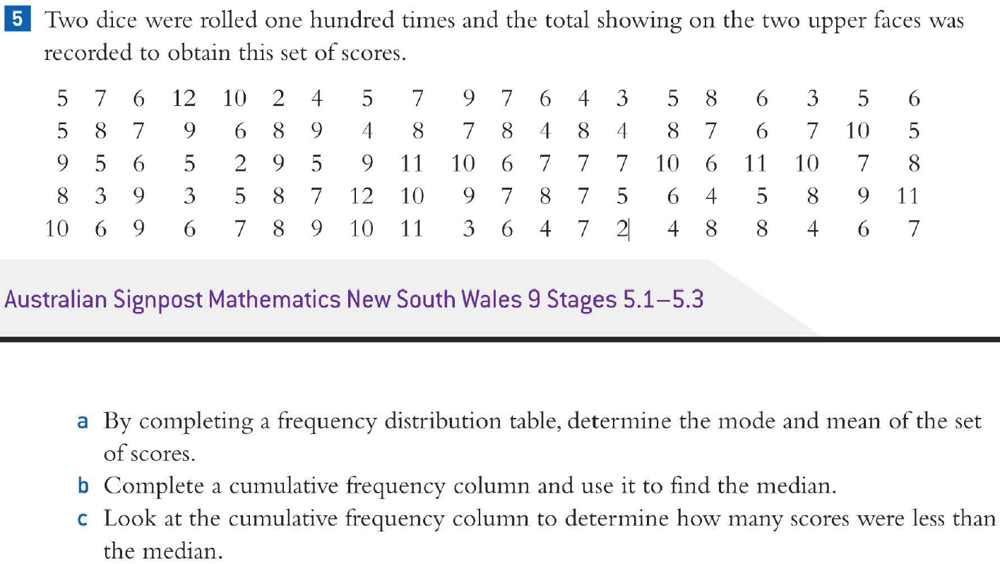

# fuck-statistics

A simple web app that takes a bunch of numbers and spews out a lot of information about them.

Currently supports showing:

- Five Point Summary (Min, Q1, Median, Q3, Max)
- Sorted Dataset
- Dataset Size
- Mean
- IQR
- Mode(s)
- Range
- Standard Deviation
- Frequency Distribution Table
- Cumulative Frequency Distribution Table

And more coming soon&trade;.

## Usage

Open the website and input the data at the top. It's separated by any whitespace and commas (the regex `/[\s,]+/` for all the programmers out there).

## Motivation

Please take a moment to observe this abomination someone dared to call a maths problem:

Now, there is **_no way in hell_** that I'm going to sort that by hand. So I'm making the computer do it. Whoever made this maths problem can go kiss my ass. And to whoever created this excuse of a maths problem, _fuck you to the moon_.
