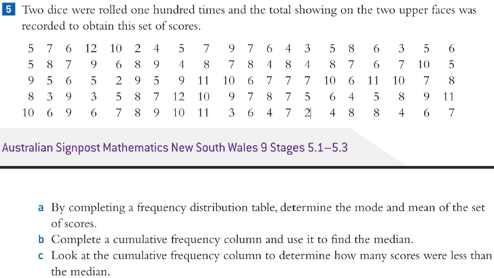

# I Hate Statistics

A simple web app that takes a bunch of numbers and spews out a lot of information about them.

Currently supports showing:

- Five Point Summary (Min, Q1, Median, Q3, Max)
- Sorted Dataset
- Dataset Size
- Mean
- IQR
- Mode(s)
- Range
- Standard Deviation
- Frequency Distribution Table
- Cumulative Frequency Distribution Table

And more coming soon&trade;.

## Usage

Open the website and input the data at the top. It's separated by any whitespace and commas (`/[\s,]+/`).

## Motivation

I made this as a response to this maths problem that I had to do:

...need I explain myself any further?
